## Detailed Documentation of Project 1
### Installing Apache and Updating Firewall

*update a list of packages in package manager*

	`sudo apt update`

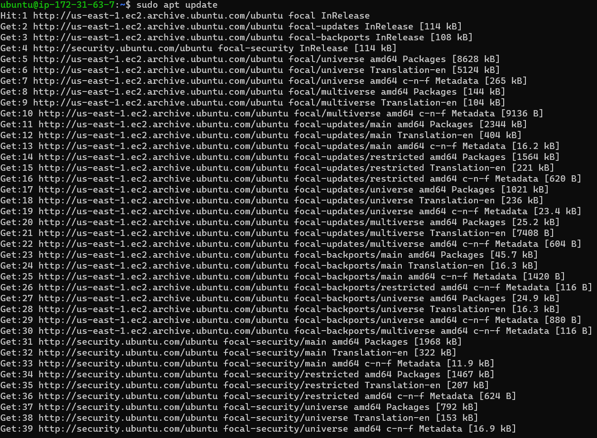

    
*run apache2 package installation*

    `sudo apt install apache2`

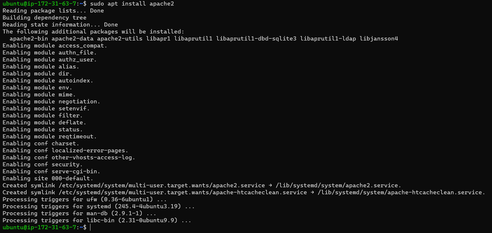

*To verify that apache2 is running as a Service in our OS, use following command*

    `sudo systemctl status apache2`

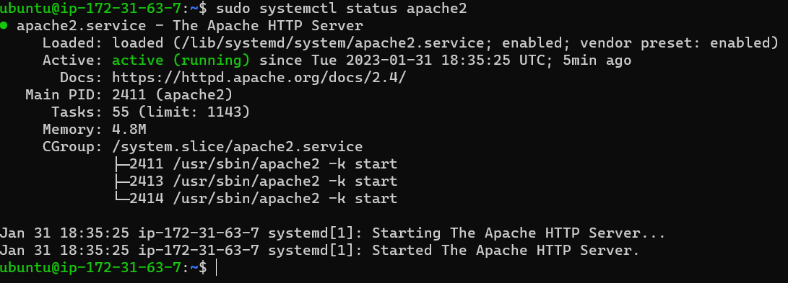

    
**Testing how Apache HTTP server can respond to requests from the Internet**

[URL to launch](http://34.207.253.203:80)

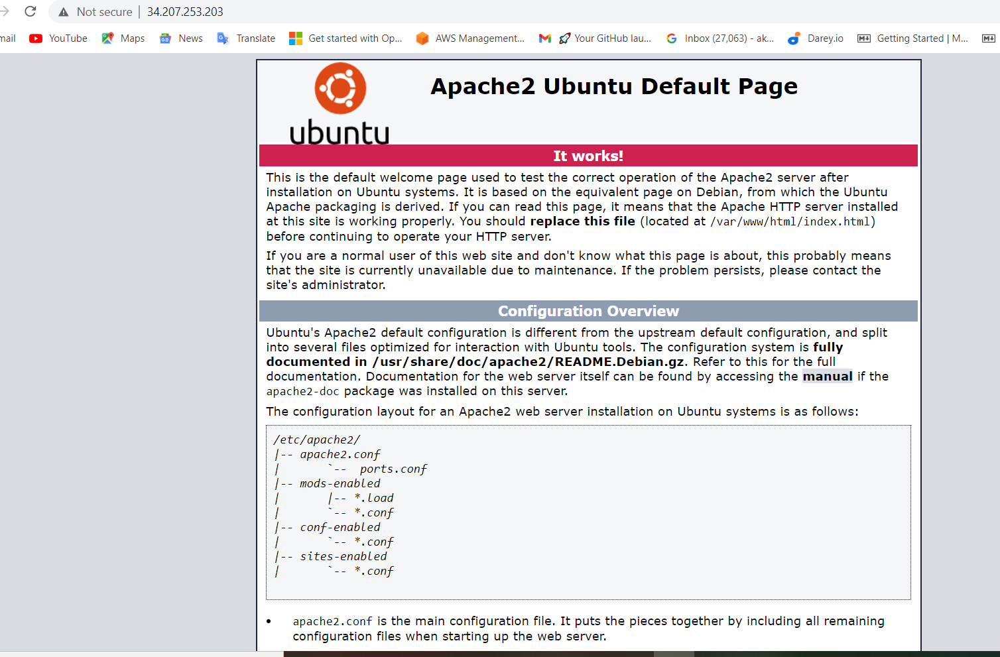

*retrieving your Public IP address through the terminal*

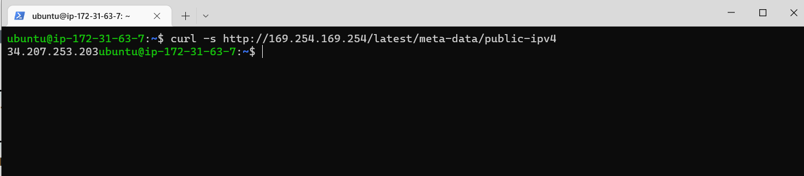

### INSTALLING MYSQL

    `sudo apt install mysql-server`

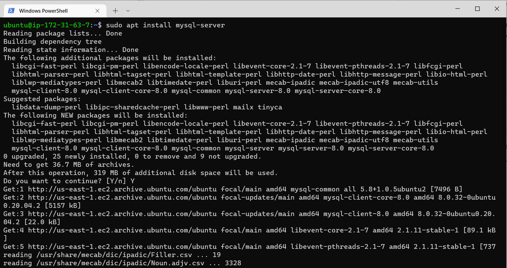

 ### Logging into the MYSQL console

    `sudo mysql`

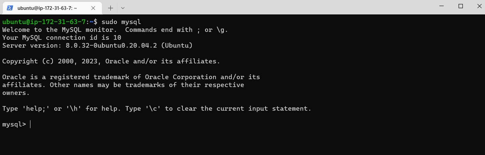

*setting password for the root user*

    `ALTER USER 'root'@'localhost' IDENTIFIED WITH mysql_native_password BY 'PassWord.1';`

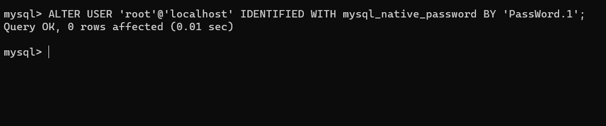

*Exiting the MYSQL Shell*

    `exit`

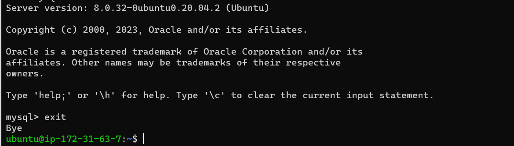

*Starting the interactive script*

    `sudo mysql_secure_installation`

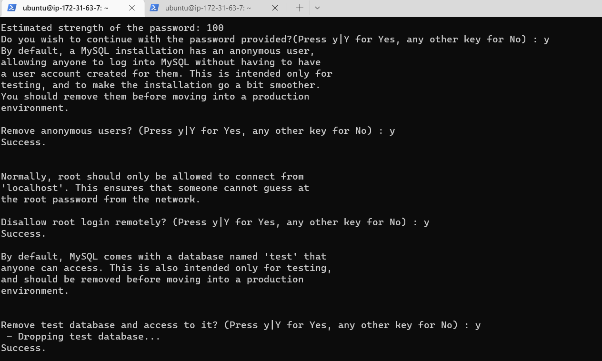
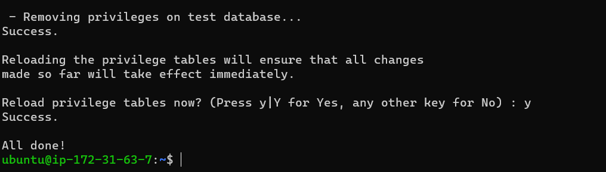

*Log in test into MYSQL Console*

    `sudo mysql -p`

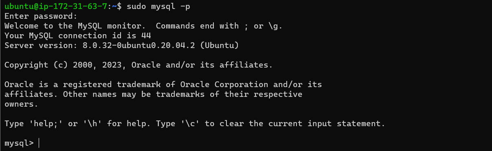

*Exiting the MYSQL Console*

    `exit`
    
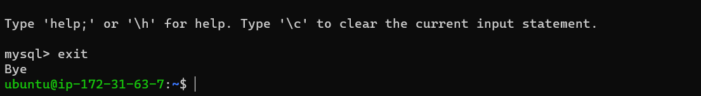