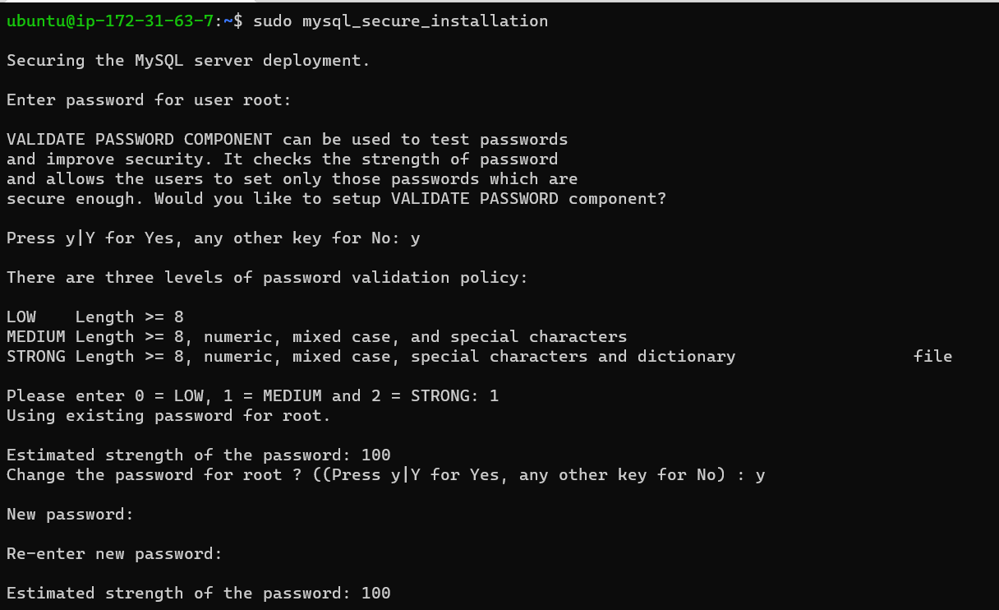

## Detailed Documentation of Project 1
### Installing Apache and Updating Firewall

*update a list of packages in package manager*

	`sudo apt update`

    
*run apache2 package installation*

    `sudo apt install apache2`

*To verify that apache2 is running as a Service in our OS, use following command*

    `sudo systemctl status apache2`

    
**Testing how Apache HTTP server can respond to requests from the Internet**

[URL to launch](http://34.207.253.203:80)

*retrieving your Public IP address through the terminal*

### INSTALLING MYSQL

    `sudo apt install mysql-server`

 ### Logging into the MYSQL console

    `sudo mysql`

*setting password for the root user*

    `ALTER USER 'root'@'localhost' IDENTIFIED WITH mysql_native_password BY 'PassWord.1';`

*Exiting the MYSQL Shell*

    `exit`

*Starting the interactive script*

    `sudo mysql_secure_installation`

*Log in test into MYSQL Console*

    `sudo mysql -p`

*Exiting the MYSQL Console*

    `exit`
    

### INSTALLING PHP

    `sudo apt install php libapache2-mod-php php-mysql`

*Confirming the PHP version*

    `php -v`

### CREATING A VIRTUAL HOST FOR YOUR WEBSITE USING APACHE
**Setting up PROJECTLAMP Domain**
*Creating the directory for projectlamp using ‘mkdir’*
    `sudo mkdir /var/www/projectlamp`
    `sudo chown -R $USER:$USER /var/www/projectlamp`
*creating and opening a new configuration file in Apache’s sites-available directory*  
    `sudo vi /etc/apache2/sites-available/projectlamp.conf`
*Enabling the new virtualhost*
    `sudo a2ensite projectlamp`
*disabling Apache’s default website*
    `sudo a2dissite 000-default`
*making sure your configuration file doesn’t contain syntax errors*
    `sudo apache2ctl configtest`
*reloading Apache so changes take effect*
    `sudo systemctl reload apache2`
*Creating an index.html file in location*
    `sudo echo 'Hello LAMP from hostname' $(curl -s http://169.254.169.254/latest/meta-data/public-hostname) 'with public IP' $(curl -s http://169.254.169.254/latest/meta-data/public-ipv4) > /var/www/projectlamp/index.html`
    

*Opening the created website URL using IP address on a browser*
[The new website using IP](http://34.207.253.203/)

*Opening the created website URL using public DNS name on a browser*
[using public DNS name](http://ec2-34-207-253-203.compute-1.amazonaws.com/)