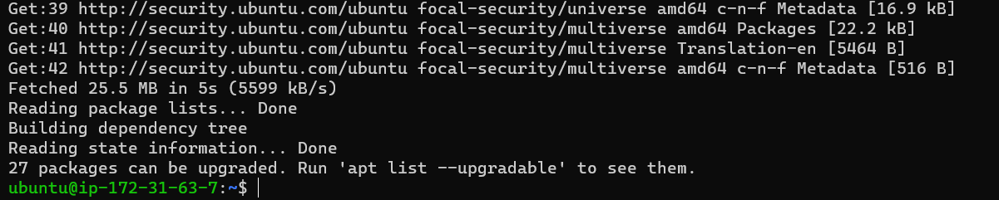

## Detailed Documentation of Project 1
### Installing Apache and Updating Firewall

*update a list of packages in package manager*

	`sudo apt update`

    
*run apache2 package installation*

    `sudo apt install apache2`

*To verify that apache2 is running as a Service in our OS, use following command*

    `sudo systemctl status apache2`

    
**Testing how Apache HTTP server can respond to requests from the Internet**

[URL to launch](http://34.207.253.203:80)

*retrieving your Public IP address through the terminal*

### INSTALLING MYSQL

    `sudo apt install mysql-server`

 ### Logging into the MYSQL console

    `sudo mysql`

*setting password for the root user*

    `ALTER USER 'root'@'localhost' IDENTIFIED WITH mysql_native_password BY 'PassWord.1';`

*Exiting the MYSQL Shell*

    `exit`

*Starting the interactive script*

    `sudo mysql_secure_installation`

*Log in test into MYSQL Console*

    `sudo mysql -p`

*Exiting the MYSQL Console*

    `exit`
    
